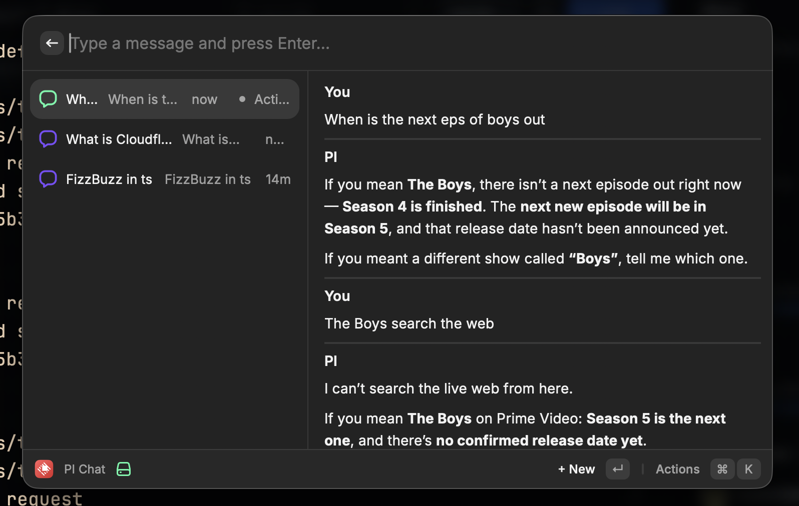

# picast

  

Picast is a Raycast chat extension for PI.

## How it works

Picast uses the `@mariozechner/pi-ai` package to talk to your local PI setup. When you send a message, the extension:

1. loads your PI settings from `~/.pi/agent/settings.json`
2. loads your PI auth credentials from `~/.pi/agent/auth.json`
3. picks the default provider/model from your PI config
4. sends the conversation to PI and shows the response in Raycast
5. stores your chat history locally in Raycast Local Storage

## Requirements

- PI must be installed and configured on your machine
- the project expects `~/.pi` files to exist

If PI is not installed or the auth/settings files are missing, chat requests will fail.

## Todo
- [ ] Add web search
